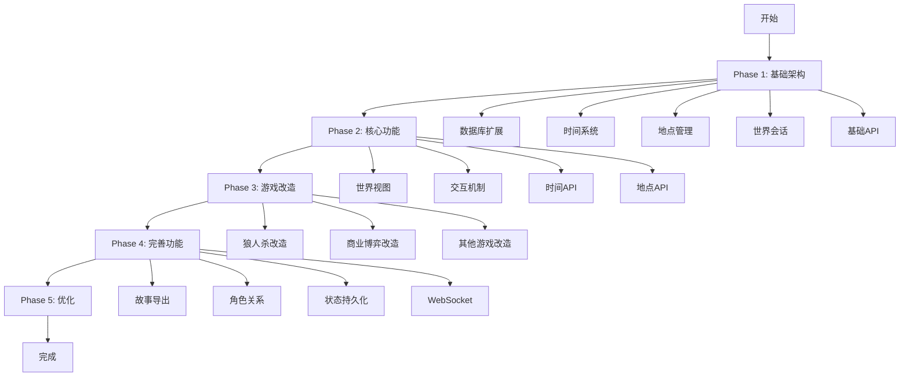
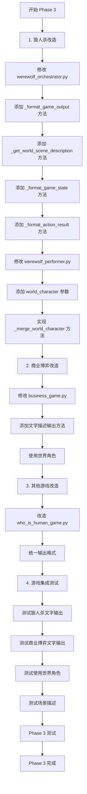
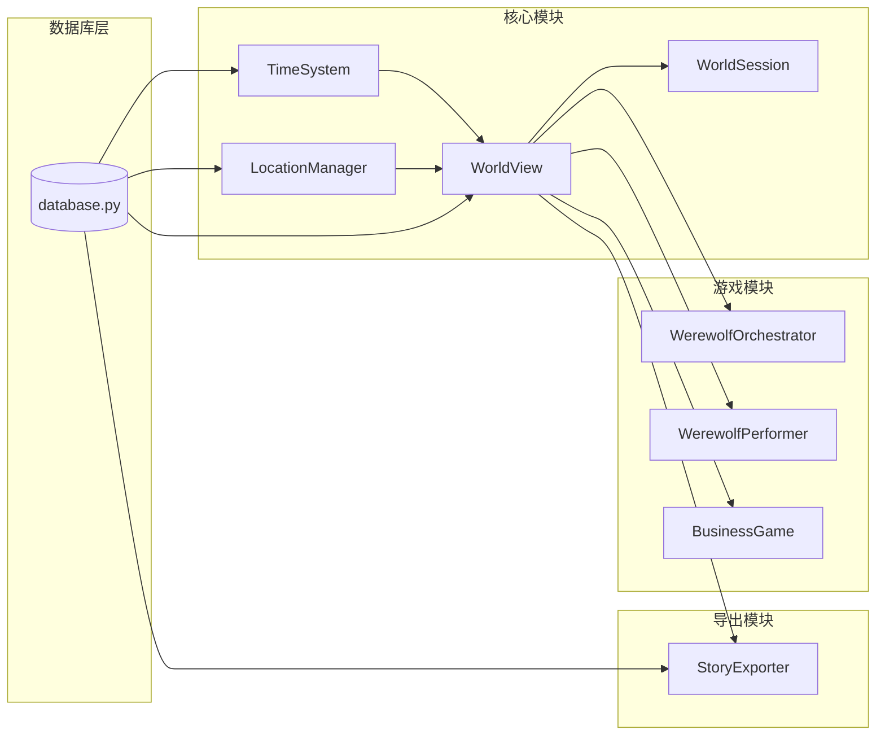

# ScrollWeaver 模块开发流程图

## 一、整体开发流程



---

## 二、Phase 1: 基础架构开发流程

```mermaid
graph TD
    Start[开始 Phase 1] --> DB[1. 数据库扩展]
    
    DB --> DB1[创建 world_sessions 表]
    DB1 --> DB2[创建 world_states 表]
    DB2 --> DB3[创建 character_relationships 表]
    DB3 --> DB4[创建 world_interactions 表]
    DB4 --> DB5[创建 world_time_events 表]
    DB5 --> DB6[创建索引]
    DB6 --> DB7[扩展 database.py 方法]
    
    DB7 --> Time[2. 时间系统模块]
    Time --> Time1[创建 modules/world/time_system.py]
    Time1 --> Time2[实现时间计算逻辑]
    Time2 --> Time3[实现暂停/恢复机制]
    Time3 --> Time4[实现强制更改时间]
    Time4 --> Time5[实现时间事件检查]
    
    Time5 --> Location[3. 地点管理模块]
    Location --> Loc1[创建 modules/world/location_manager.py]
    Loc1 --> Loc2[实现地点列表查询]
    Loc2 --> Loc3[实现地点详情查询]
    Loc3 --> Loc4[实现地点切换]
    Loc4 --> Loc5[实现可用玩法检查]
    
    Loc5 --> Session[4. 世界会话扩展]
    Session --> Ses1[扩展 SessionMode 枚举]
    Ses1 --> Ses2[创建 WorldSession 类]
    Ses2 --> Ses3[扩展 SessionManager]
    
    Ses3 --> API[5. 基础API实现]
    API --> API1[GET /api/crossworld/list-scrolls]
    API1 --> API2[GET /api/crossworld/{scroll_id}/characters]
    API2 --> API3[POST /api/crossworld/create-session]
    API3 --> API4[GET /api/world/{session_id}/status]
    
    API4 --> Test1[Phase 1 测试]
    Test1 --> End1[Phase 1 完成]
```

---

## 三、Phase 2: 核心功能开发流程

```mermaid
graph TD
    Start[开始 Phase 2] --> WorldView[1. 世界视图模块]
    
    WorldView --> WV1[创建 modules/world/world_view.py]
    WV1 --> WV2[集成 TimeSystem]
    WV2 --> WV3[集成 LocationManager]
    WV3 --> WV4[实现世界状态管理]
    WV4 --> WV5[实现初始化方法]
    
    WV5 --> Interaction[2. 交互机制实现]
    Interaction --> Int1[实现 start_chat 方法]
    Int1 --> Int2[实现 start_story 方法]
    Int2 --> Int3[实现 start_game 方法]
    Int3 --> Int4[实现交互记录功能]
    
    Int4 --> TimeAPI[3. 时间API实现]
    TimeAPI --> TA1[GET /api/world/{session_id}/time]
    TA1 --> TA2[PUT /api/world/{session_id}/time]
    TA2 --> TA3[PUT /api/world/{session_id}/time-speed]
    
    TA3 --> LocationAPI[4. 地点API实现]
    LocationAPI --> LA1[GET /api/world/{scroll_id}/locations]
    LA1 --> LA2[GET /api/world/{scroll_id}/location/{code}]
    LA2 --> LA3[POST /api/world/{session_id}/move]
    
    LA3 --> InteractionAPI[5. 交互API实现]
    InteractionAPI --> IA1[POST /api/world/{session_id}/start-chat]
    IA1 --> IA2[POST /api/world/{session_id}/start-story]
    IA2 --> IA3[POST /api/world/{session_id}/start-game]
    
    IA3 --> Test2[Phase 2 测试]
    Test2 --> End2[Phase 2 完成]
```

---

## 四、Phase 3: 游戏改造开发流程



---

## 五、Phase 4: 完善功能开发流程

```mermaid
graph TD
    Start[开始 Phase 4] --> Export[1. 故事导出模块]
    
    Export --> EX1[创建 modules/world/story_exporter.py]
    EX1 --> EX2[实现 export_story 方法]
    EX2 --> EX3[实现 _generate_txt_content 方法]
    EX3 --> EX4[实现 GET /api/world/{session_id}/export-story]
    
    EX4 --> Relationship[2. 角色关系系统]
    Relationship --> RE1[实现关系保存方法]
    RE1 --> RE2[实现关系查询方法]
    RE2 --> RE3[实现关系更新方法]
    RE3 --> RE4[实现 GET /api/world/{session_id}/relationships]
    RE4 --> RE5[实现 POST /api/world/{session_id}/update-relationship]
    
    RE5 --> Persistence[3. 世界状态持久化]
    Persistence --> PS1[实现状态保存逻辑]
    PS1 --> PS2[实现状态恢复逻辑]
    PS2 --> PS3[实现自动保存机制]
    
    PS3 --> WebSocket[4. WebSocket支持]
    WebSocket --> WS1[实现 WS /ws/world/{session_id}]
    WS1 --> WS2[实现实时世界更新]
    WS2 --> WS3[实现时间事件推送]
    WS3 --> WS4[实现地点变化推送]
    
    WS4 --> Soulverse[5. Soulverse集成]
    Soulverse --> SV1[确认Soulverse API]
    SV1 --> SV2[实现AI代理模式]
    SV2 --> SV3[实现灵魂降临功能]
    
    SV3 --> Test4[Phase 4 测试]
    Test4 --> End4[Phase 4 完成]
```

---

## 六、详细模块依赖关系



---

## 七、开发时间线（建议）

### Week 1: Phase 1 基础架构
- **Day 1-2**: 数据库扩展（表创建、方法扩展）
- **Day 3-4**: 时间系统模块开发
- **Day 5**: 地点管理模块开发
- **Day 6-7**: 世界会话扩展和基础API

### Week 2: Phase 2 核心功能
- **Day 1-2**: 世界视图模块开发
- **Day 3**: 交互机制实现
- **Day 4-5**: 时间API和地点API
- **Day 6-7**: 交互API和集成测试

### Week 3: Phase 3 游戏改造
- **Day 1-3**: 狼人杀改造
- **Day 4-5**: 商业博弈改造
- **Day 6-7**: 其他游戏改造和测试

### Week 4: Phase 4 完善功能
- **Day 1-2**: 故事导出模块
- **Day 3**: 角色关系系统
- **Day 4**: 世界状态持久化
- **Day 5-6**: WebSocket支持
- **Day 7**: Soulverse集成和整体测试

---

## 八、关键开发节点检查清单

### Phase 1 完成检查
- [ ] 所有数据库表创建成功
- [ ] `TimeSystem` 时间计算正确
- [ ] `LocationManager` 地点查询正常
- [ ] `WorldSession` 可以创建和初始化
- [ ] 基础API可以正常调用

### Phase 2 完成检查
- [ ] `WorldView` 可以正常初始化
- [ ] 可以启动私语、入卷、雅集
- [ ] 时间API返回正确的时间
- [ ] 地点切换功能正常
- [ ] 交互记录正常保存

### Phase 3 完成检查
- [ ] 狼人杀输出为文字描述
- [ ] 商业博弈输出为文字描述
- [ ] 游戏使用世界角色
- [ ] 游戏包含场景描述
- [ ] 原有游戏功能不受影响

### Phase 4 完成检查
- [ ] 故事可以正常导出为TXT
- [ ] 角色关系可以保存和查询
- [ ] 世界状态可以持久化
- [ ] WebSocket实时更新正常
- [ ] Soulverse集成正常

---

## 九、开发注意事项

### 9.1 开发顺序
1. **必须先完成数据库扩展**，其他模块都依赖数据库
2. **时间系统和地点管理可以并行开发**，它们相对独立
3. **世界视图必须在时间系统和地点管理完成后开发**
4. **游戏改造可以在核心功能完成后进行**

### 9.2 测试策略
- **每个Phase完成后进行单元测试**
- **关键功能完成后进行集成测试**
- **所有Phase完成后进行端到端测试**

### 9.3 代码审查点
- **数据库设计审查**：表结构是否合理
- **API设计审查**：接口是否易用
- **模块设计审查**：模块职责是否清晰
- **性能审查**：是否有性能瓶颈

---

## 十、风险控制点

### 10.1 关键风险点
1. **时间系统复杂度**：需要充分测试时间计算逻辑
2. **数据库性能**：大量交互记录可能影响性能
3. **游戏改造兼容性**：可能影响现有游戏稳定性

### 10.2 应对措施
- **时间系统**：先实现简单版本，逐步完善
- **数据库性能**：使用索引，定期归档
- **游戏改造**：保持架构不变，充分测试

---

**文档版本**：v1.0  
**创建时间**：2025-12-19  
**最后更新**：2025-12-19

